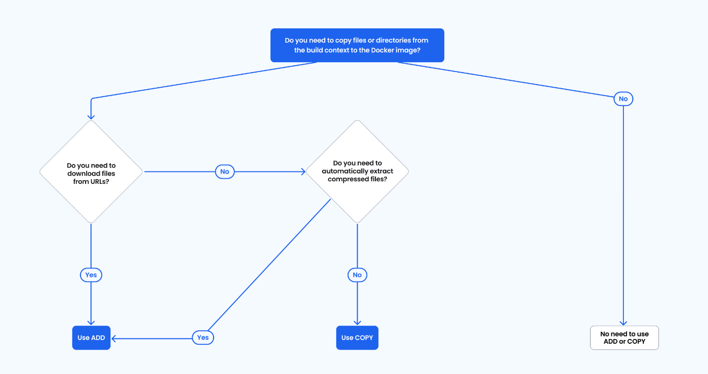

# 도커 컨테이너 실행 시 자주 사용되는 옵션


### 자주 사용하는 docker run 옵션

1. **포트 매핑**
   - `-p, --publish`: 호스트와 컨테이너 간 포트 매핑
   ```
   -p 8080:80    # 호스트의 8080 포트를 컨테이너의 80 포트에 연결
   -p 호스트포트:컨테이너포트
   ```

2. **백그라운드 실행**
   - `-d, --detach`: 컨테이너를 백그라운드에서 실행
   ```
   -d    # 터미널에서 분리하여 백그라운드로 실행
   ```

3. **컨테이너 이름 지정**
   - `--name`: 컨테이너에 이름 부여
   ```
   --name myapp    # 컨테이너 이름을 'myapp'으로 지정
   ```

4. **자동 삭제**
   - `--rm`: 컨테이너 종료 시 자동 삭제
   ```
   --rm    # 컨테이너가 종료되면 자동으로 삭제
   ```

5. **볼륨 마운트**
   - `-v, --volume`: 호스트와 컨테이너 간 볼륨 마운트
   ```
   -v /host/path:/container/path    # 호스트 디렉토리를 컨테이너에 마운트
   ```

6. **환경 변수 설정**
   - `-e, --env`: 환경 변수 설정
   ```
   -e DB_HOST=mysql -e DB_PORT=3306    # 환경 변수 설정
   ```

7. **네트워크 연결**
   - `--network`: 컨테이너를 특정 네트워크에 연결
   ```
   --network my-network    # 컨테이너를 'my-network'에 연결
   ```

8. **인터랙티브 모드**
   - `-i, -t` 또는 `-it`: 대화형 터미널 연결
   ```
   -it    # 터미널과 상호작용 가능한 모드로 실행
   ```

9. **리소스 제한**
   - `--memory`: 메모리 제한
   - `--cpus`: CPU 제한
   ```
   --memory=512m --cpus=0.5    # 메모리 512MB, CPU 50% 제한
   ```

10. **재시작 정책**
    - `--restart`: 컨테이너 재시작 정책
    ```
    --restart=always    # 항상 재시작
    --restart=on-failure:5    # 실패 시 최대 5번 재시작
    ```

당신이 예시로 든 명령어는 이미 여러 유용한 옵션을 포함하고 있습니다:
```
docker run -p 3000:80 -d --rm --name myson f01287d93b1a
```
- `-p 3000:80`: 호스트의 3000 포트를 컨테이너의 80 포트에 매핑
- `-d`: 백그라운드에서 실행
- `--rm`: 컨테이너 종료 시 자동 삭제
- `--name myson`: 컨테이너 이름을 'myson'으로 설정
- `f01287d93b1a`: 실행할 이미지 ID


# dockerfile 작성 예시
---------------------
 ### FROM node
>베이스 이미지 설정 (기본적으로 최신 node.js 이미지를 사용)

### WORKDIR /app
>컨테이너 내부 작업 디렉토리 설정 (절대 경로)

### COPY package.json /app
>package.json 파일만 먼저 복사

### RUN npm install
>패키지 설치 (의존성 설치) | 최적화 포인트

### COPY . /app
>파일 복사: 
>- 첫 번째 인자 `.`: Dockerfile이 있는 디렉토리의 모든 파일을 의미
>- 두 번째 인자 `./`: 컨테이너 내부의 현재 작업 디렉토리 (`WORKDIR`에서 지정한 `/app`)를 의미

### EXPOSE 80
>컨테이너가 외부에서 접근할 수 있도록 포트 80을 개방

### CMD ["node", "server.js"]
>컨테이너 실행 시 실행할 명령 설정

>주의: CMD는 배열 형식일 경우 쉘을 거치지 않고 직접 실행됨

------------------------------------------

# COPY와 ADD의 차이 

COPY 명령어는 새로운 파일을 에서 복사하여 경로의 컨테이너 파일시스템에 추가합니다.
ADD 명령은 새 파일을 에서 복사하여 경로의 컨테이너 파일 시스템에 추가합니다.

## ADD의 추가 기능
URL을 활용하여 파일 다운로드
ADD 명령어의 출발 경로를 입력하는 부분에 호스트 경로 대신 URL을 입력할 수 있습니다.
URL을 입력할 경우, 해당 원격지로부터 파일을 다운로드하여 Docker 이미지의 도작 경로에 추가됩니다.
압축 자동 해제 및 추출
ADD 명령어의 출발 경로에 호스트 내에 압축(gz, bz2, xz)된 tar 아카이브 파일이 들어갈 수도 있습니다.
압축 파일은 자동으로 해제되며, 이때 추출된 디렉토리가 Docker 이미지의 도착 경로에 저장됩니다.

공식문서: ADD와 COPY의 적절한 사용방법
https://www.docker.com/blog/docker-best-practices-understanding-the-differences-between-add-and-copy-instructions-in-dockerfiles/


단순성과 보안성으로 대부분이 COPY 


참조 :
https://www.tempmail.us.com/ko/dockerfile/dockerfile%EC%9D%98-copy-%EC%99%80-add-%EB%AA%85%EB%A0%B9-%EA%B0%84%EC%9D%98-%EC%B0%A8%EC%9D%B4%EC%A0%90-%EC%9D%B4%ED%95%B4



# 컨테이너 내부에서 외부로 이동해야할 파일이 뭐가 있을까?

컨테이너는 기본적으로 휘발성.

1. 로그
2. 데이터베이스의 경우 데이터
3. ???
