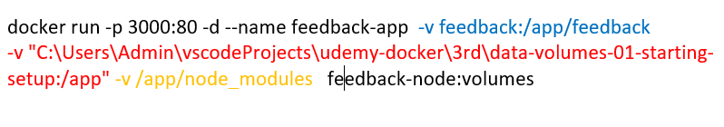
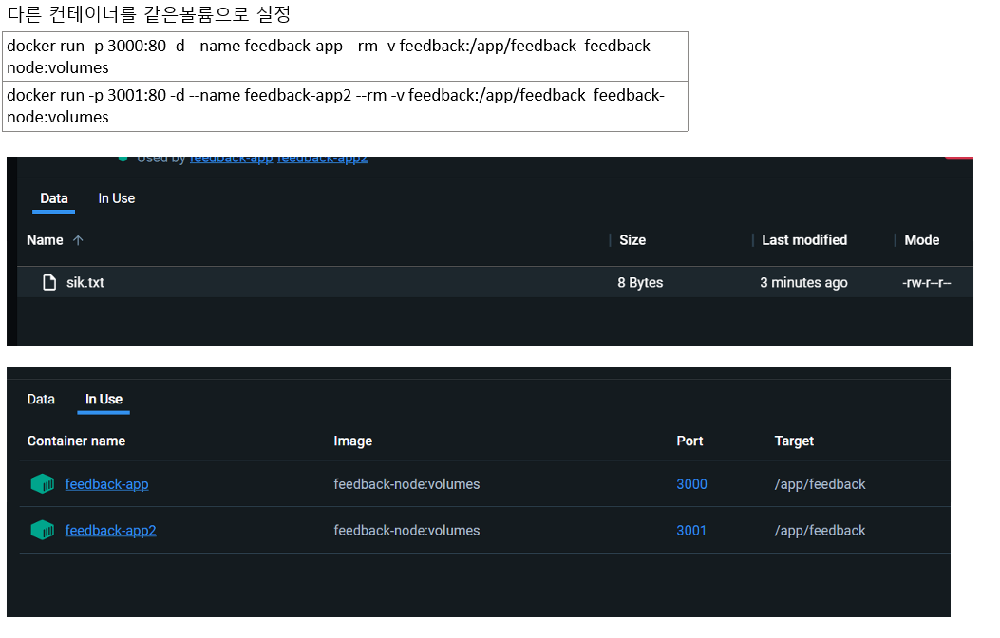
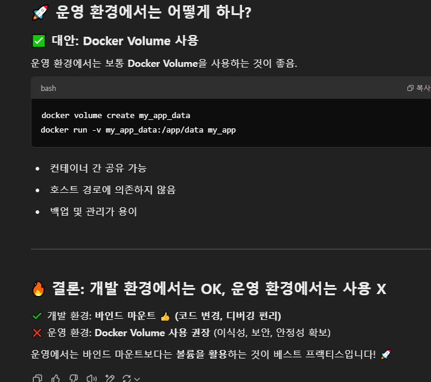
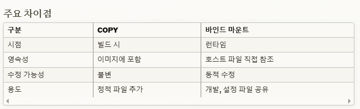
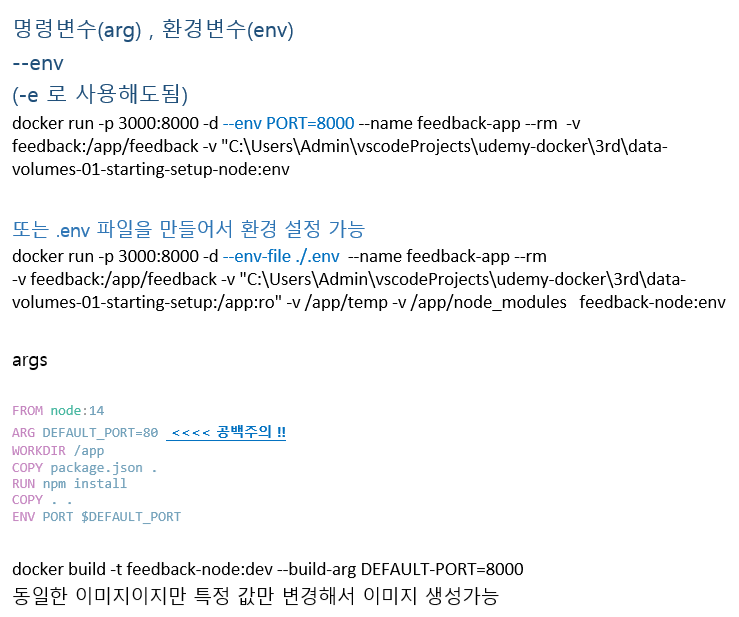
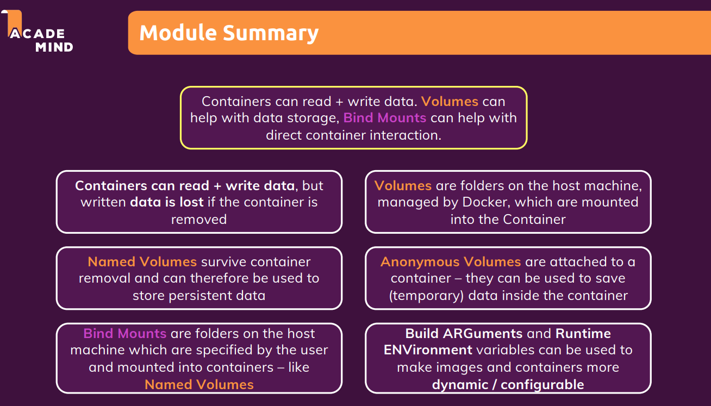

# 볼륨의 목적

> 컨테이너는 휘발성이기때문에, 볼륨의 역할은
저장을 필요로 하는 정보들을 (로그, 데이터)
호스트머신에 연동하여 해당 정보들을 저장

-----------------

1. 지정볼륨(Named Volume) : 컨테이너를 삭제하여도 존재하며, 데이터간 공유가 가능.
    ++ 로그, 데이터베이스 데이터

-v [이름]:[저장할 내부경로지정]
-v feedback:/app/feedback

--------------

2. 익명볼륨(Anonymous Volume) : 임시저장, 즉 컨테이너 종료시 삭제, 컨테이너간 데이터 공유 불가
     (의존성 파일 ex. node_moudles)
   ++ 바인트마운트시 덮어쓰기 제외 역할을 수행하기도 한다. 

-v [경로]
-v /app/node_modules
-----------------
3. 바인트마운트(Bind Mounts) : 호스트에 존재하여, 컨테이너 종료하여도 존재한다. 
   - 런타임환경에서 컨테이너와 호스트머신 동적으로 연결하기때문에 실시간 반영이 가능하다.
   $$ 
   바인트 마운트는 개발환경에서만 사용하는 것이 좋을 것같다

-v [호스트 경]:[컨테이너 경로]
-v "C:\Users\data-volumes-01-starting-setup:/app"

>바인드 마운트: 호스트의 특정 디렉터리를 컨테이너와 연결 (ex. -v "C:\path:/app")
이름 있는 볼륨: Docker가 관리하는 저장소를 사용 (ex. -v feedback:/app/feedback)
익명 볼륨: 컨테이너 내부에서만 유지되는 데이터 저장 공간 (ex. -v /app/node_modules)

---------

# Copy 와 바인트 마운트 어떻게 사용해야할까??

Docker에서 Copy와 바인드 마운트는 데이터를 컨테이너에 전달하는 두 가지 주요 방법.
1. COPY (복사)

Dockerfile에서 사용되는 명령어
호스트의 파일/디렉토리를 이미지 내부로 영구적으로 복사
이미지 빌드 시점에 파일을 컨테이너 내부에 포함
이미지의 일부가 되어 불변성 유지
빌드 시간에 파일 추가에 적합

dockerfileCopy 예시
COPY ./source /app/destination

2. 바인드 마운트 (Bind Mount)

런타임에 호스트의 파일/디렉토리를 컨테이너에 동적으로 연결
호스트와 컨테이너 간 실시간 파일 공유
개발 환경에서 소스코드 변경 실시간 반영에 유용
컨테이너 외부에서 파일 수정 가능

bashCopy# Docker Run 시 바인드 마운트 예시
docker run -v /host/path:/container/path myimage

## 주요 차이점

* COPY 사용하는 예시
- 파일의 불변할 때

* 바인드 마운트 예시
- 컨테이너와 호스트 연결 및 파일이 가변

권장 사용 패턴

프로덕션: COPY 사용 (이미지 불변성)
개발: 바인드 마운트 사용 (실시간 개발)

# igonre을 해야 하는 경우 

1. 액세스 키
2. 암호화 키 

보안
- 액세스키 등 보안과 관련된 정보는 그냥 image에 넣지 말고 docker run할때 환경변수로 넣자.

개발, QA, 운영 환경구분이 따로 있는상황에서 사용. 

# 요약

# 기타
바인드 마운트를 많이 사용하는가? => 특정 호스트머신에 의존..

로그 저장은 Named Volume을 사용하는게 좋지 않을까.
