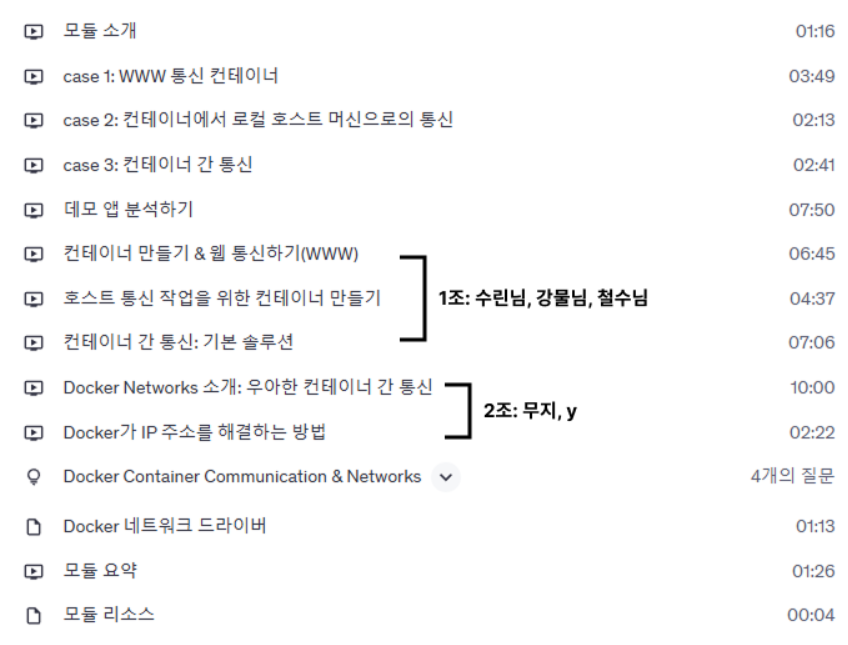
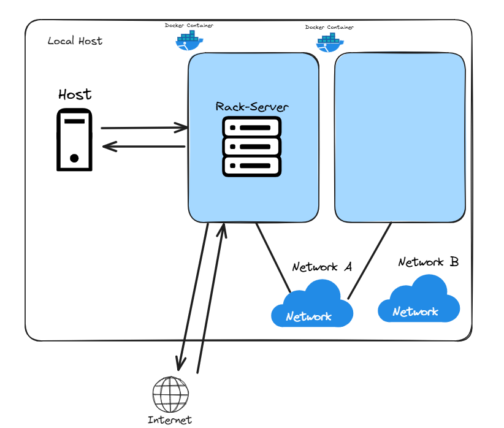
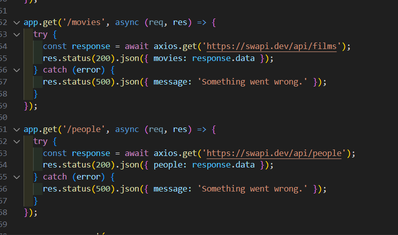
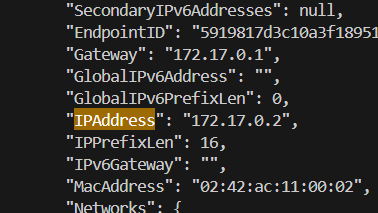
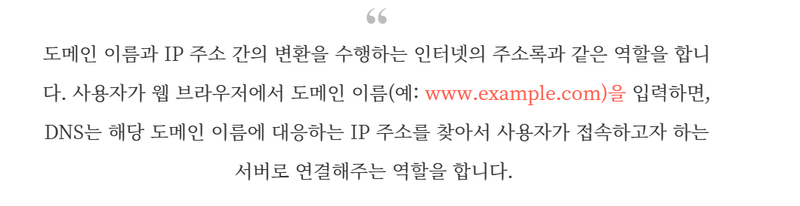

# 네트워킹 (컨테이너 통신)




## 도커에서 이루어지는 네트워크 통신




### 1. 외부 API 통신 
### 2. 로컬 호스트 머신 통신 
### 3. 다른 컨테이너와 통신


## 1. 외부와 API 통신



- 컨테이너가 외부로 요청을 보낼 때는 호스트의 네트워크 인터페이스를 통해 나갑니다.


## 2. 로컬 호스트 머신과 통신

```
mongoose.connect(
  // 'mongodb://localhost:27017/swfavorites',
  'mongodb://host.docker.internal:27017/swfavorites', // 호스트머신 ip 로 변환
  { useNewUrlParser: true },
  (err) => {
    if (err) {
      console.log(err);
    } else {
      app.listen(3000);
    }
  }
);
```

## 3. 외부 컨테이너와 통신


- ' docker container inspect mongodb' 로 외부컨테이너의 주소를 알 수있다.
그러나 IP는 변할 수 있음..

- 컨테이너간 통신을 위해선, 네트워크를 생성해야됨
'docker network [이름]'

- 이후에 컨테이너 실행시 네트워크에 등록. 
- docker run -d --name app1 --network my-network my-app
- docker run -d --name app2 --network my-network my-app

```

mongoose.connect(
  // 'mongodb://localhost:27017/swfavorites', // docker 사용 x 
  // 'mongodb://host.docker.internal:27017/swfavorites', // 로컬 호스트머신 ip 로 변환
  // 'mongodb://172.17.0.2:27017/swfavorites', // 도커 컨테이너 주소 (변할 수 있음..)
  'mongodb://mongodb:27017/swfavorites', // 컨테이너 이름 입력 => 도커 ip로 변화  ! 
  { useNewUrlParser: true },
  (err) => {
    if (err) {
      console.log(err);
    } else {
      app.listen(3000);
    }
  }
);
```

- ** 추가적으로 컨테이너간 통신시, 포트를 지정하지 않음 .
- ** 내장된 DNS 서버가 존재. 그래서 IP 가 변하여도 상관이 없다!
- ** 또한 여러개의 네트워크에 등록가능.


https://like-money-programer.tistory.com/entry/Docker-%EC%BB%A8%ED%85%8C%EC%9D%B4%EB%84%88-%EA%B0%84-%ED%86%B5%EC%8B%A0-%EC%9B%90%EB%A6%AC

-공식문서
https://docs.docker.com/engine/network/#dns-services

** 이후 도커 컴포즈와 관련이 있을지도..?
