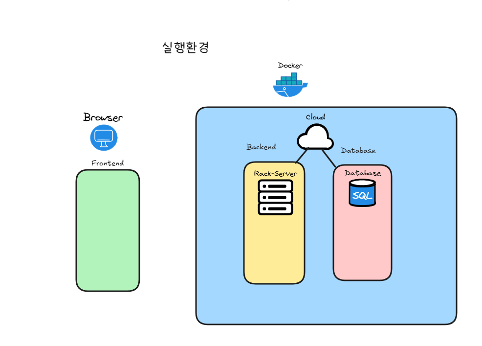
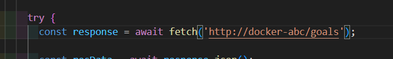

# 실행환경의 차이 

- 프론트엔드
- 백엔드
- 데이터베이스 

로컬 호스트 머신이 아닌 도커 네트워크를 통해 
각 컨테이너끼리 통신을 하고자 한다.

## 실행시, 프론트측에서 백엔드와 연결이 되지 않음.
- 그 이유는 실행환경의 차이..

프론트엔드의 JavaScript 코드는 결국, 
사용자의 브라우저 즉 호스트머신에서 실행되기때문에

*** 브라우저는 컨테이너의 도메인 주소를 모른다. 

결국엔 프론트엔드 request api 주소는 외부 도메인 주소를 사용해야한다 ! 
