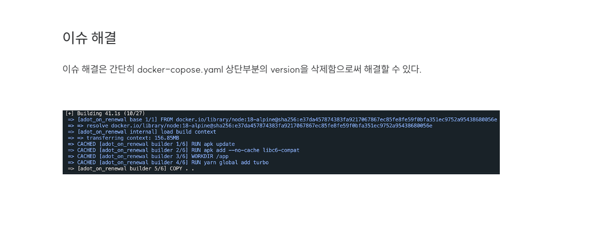
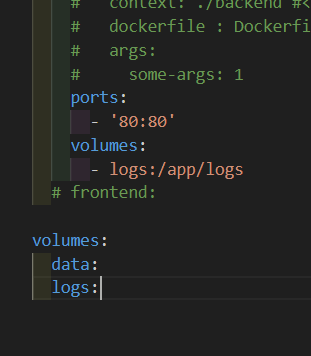

# 도커 컴포즈 

## 도커 컴포즈의 목적
- 단일 호스트 머신에서 여러개의 컨테이너를 관리! 

** 다만 DockerCompose가 단일 Dockerfile을 대체할 순 없다...
** 또한 멀티 호스트 환경에서 다중 컨테이너를 관리하지 않는다.
---> k8s(쿠버네티스??)

-------------
** 강의에서 version 을 사용하지만 현재는 더이상 사용하지 않음

https://teveloper.tistory.com/82

docker-compose v2.25.0 이상 버전부터는
docker-compose.yml파일의 최상단에 작성된 version : '3' 이 필요없어졌다고 한다.
따라서, 위의 이유로 발생하는 경고이며 해결방법은 docker-compose.yml의 version을 삭제해주면 된다.
-----------

docker-compose.yaml 구성

------------------------------
services:
  mongodb: <---- 컨테이너 명 
    image: 'mongo'  <---- 이미지 이름(로컬에 없으면 원격 repo)
    volumes :  <--- 볼륨설정, 다중 볼륨 가능 ! 
      - data:/data/db
    
    environment: <---- 시스템 환경 변수 직접설정
      DB_ID : test
      DB_PW : abc1234
    env_file:  <---- 환경 변수 파일로 설정
      - ./env/mongo/env
    networks : <--- 특정 네트워크 연결, 다중 가능
      - goals-net
  backend:
    ........
  frontend:
    ........

volumes: <-------- 컨테이너 공유 볼륨(명명 볼륨)
  data:
----------------------------

위에서 네트워크를 설정하지 않아도 동일한 네트워크를 가지게 된다...

