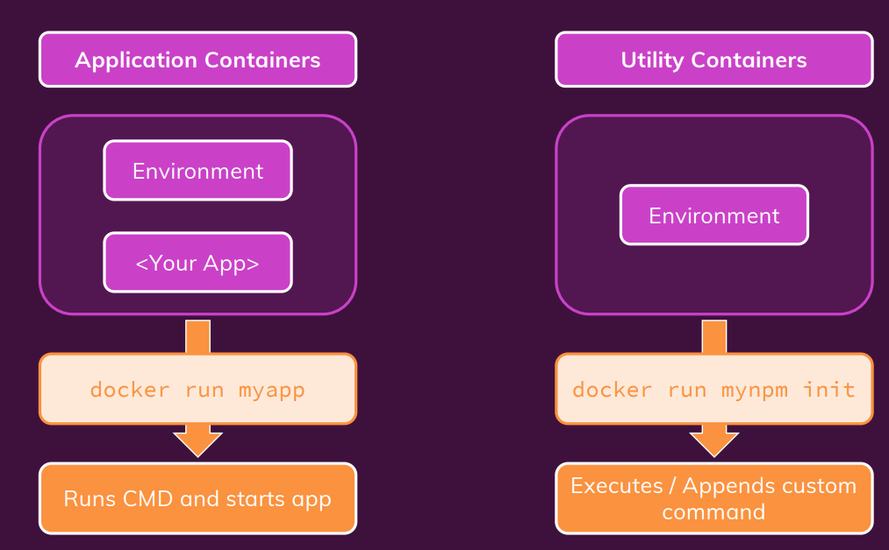

# 유틸리티 컨테이너




##  목적 
  1. 개발 소스를 포함하지 않음
  2. 개발 환경만 포함 


## 사용하는 이유
  - 시스템에 설정에 대한 부가적인 툴
  - 시스템 환경만 필요할때

-> 로컬 환경에 node가 미설치, 그렇지만 node 어플리케이션을 실행시키고 싶다.


### Dockerfile
* 최대한 슬림한 버젼이 필요

```
FROM node:14-alpine

WORKDIR /app

ENTRYPOINT [ "npm" ]
```


### 이미지 생성 명령어.
> docker build -t node-util


### 바인드 마운트를 활용 의존성 파일을 로컬에 주입.
> docker run -it -v /로컬경로:/app node-util npm init

생성이후 컨테이너는 중지.

### 엔트리포인트
> ENTRYPOINT [ "npm" ]

-> 이름뒤 명령의 prefix
ex) init , 실제 실행 명령어 "npm init" 
> docker run -it -v /로컬경로:/app node-util mynpm init

### docker compose 
> docker-compose run --rm npm(서비스이름) init

---------------

실무에서는 자주 사용할까?
--> 여러 개발자들이 개발환경 셋팅을 공유하기에 용이! 
--> 특정버전의 특정라이브러리를 명시 가능.


출처 : https://blogshine.tistory.com/571