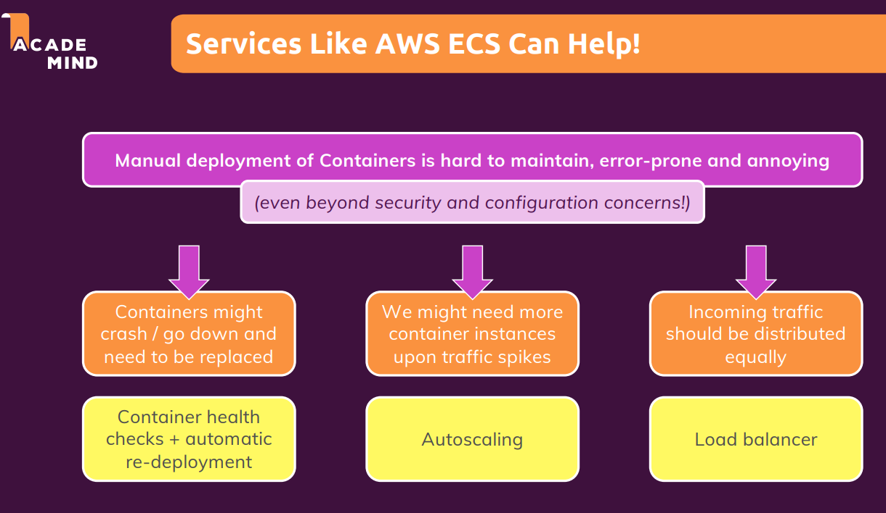
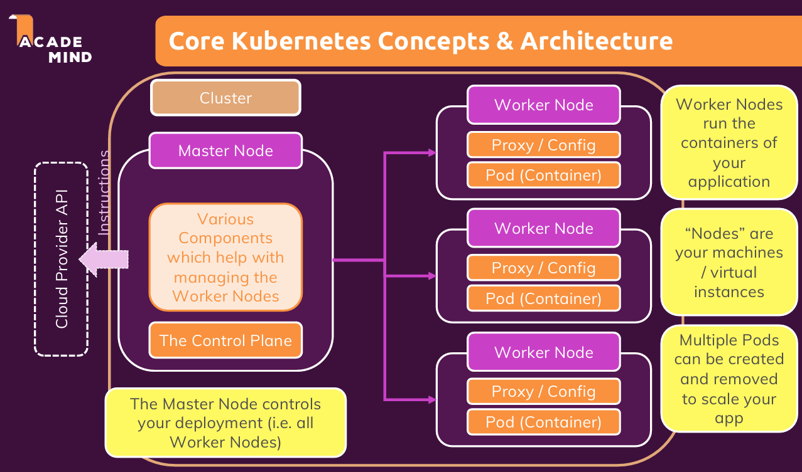
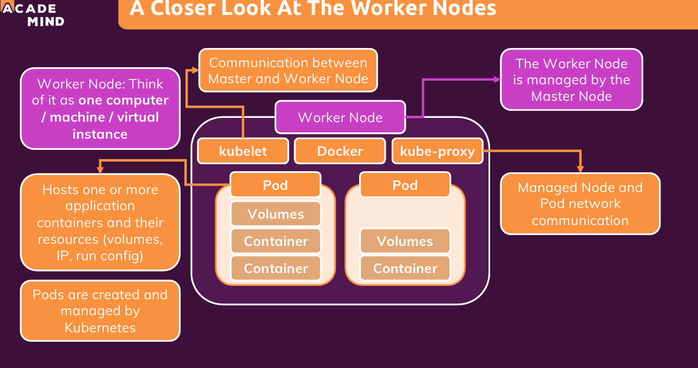
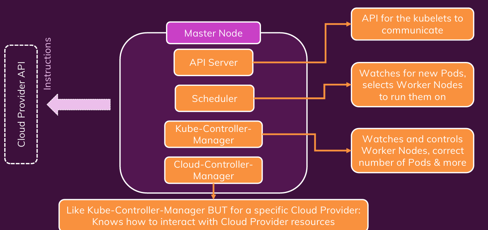

# 쿠버네티스
- Docker 같은 컨테이너 기술로 실행되는 애플리케이션들을 자동화된 방식으로 배포, 운영, 확장, 복구하는 플랫폼

## 역할

1. 컨테이너 상태를 자동적으로 확인
2. 오토스케일링
3. 로드밸런서 

## 쿠버네티스 아키텍처

1. Pod
쿠버네티스의 가장 작은 배포 단위

하나 이상의 컨테이너를 포함할 수 있으며, 같은 네트워크/스토리지를 공유함

실제로는 거의 항상 하나의 컨테이너만 포함 (마이크로서비스 기준)

예: nginx 웹서버 하나를 실행하는 Pod → nginx 컨테이너 하나가 들어있음

하나의 어플리케이션, 하나의 볼륨 

2. Worker Node 

실제로 컨테이너(Pod)를 실행하는 서버

쿠버네티스 클러스터에 속한 물리 서버 또는 가상 서버 (ec2의 인스턴스)

* 워커노드에는 도커 설치가 되어있어야 된다. 

- 구성 요소:
* kubelet(큐블렛): 해당 노드의 Pod 상태 관리

* kube-proxy(큐베 프록시): 네트워크 프록시로서 서비스 트래픽 관리

3. Master Node

클러스터 전체를 제어하고 조율하는 역할

애플리케이션 배포, 상태 모니터링, 스케일링 등을 결정

주요 구성 요소:

API Server: 모든 명령의 중심, 외부/내부 통신 지점 (유일한 진입점)

Scheduler: 어떤 노드에 Pod를 배치할지 결정

Kube-Controller Manager: 클러스터 상태를 원하는 상태로 유지 (감시)

Cloud-Controller Manager: 클라우드 환경(GCP, AWS, Azure 등)과 쿠버네티스 클러스터를 연결해주는 컴포넌트